# FirstApp

This project was generated with [Angular CLI](https://github.com/angular/angular-cli) version 16.2.1.

## :sparkles: Features

This app include:

-   An Endpoint to host the Housing Location Data (hosted at [http://localhost:3000](http://localhost:3000)).

-   A search input to find Housing Locations by City Name.

-   A register form to buy a House with First Name, Last Name and E-mail. The data will stored at console log of your browser.

## Development server

Run local server
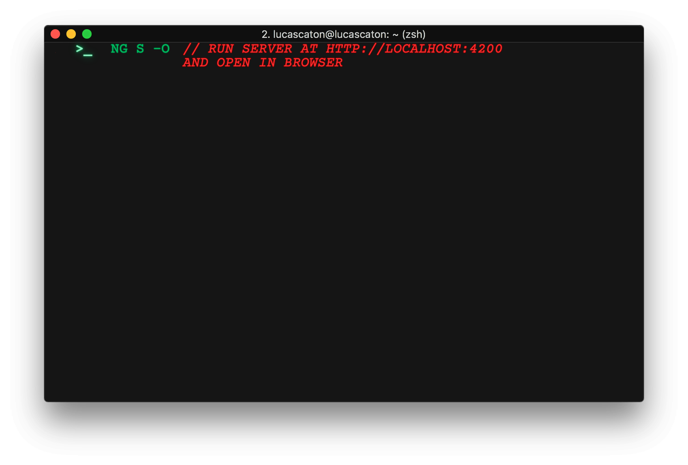

The application will automatically reload if you change any of the source files.

Run endpoint
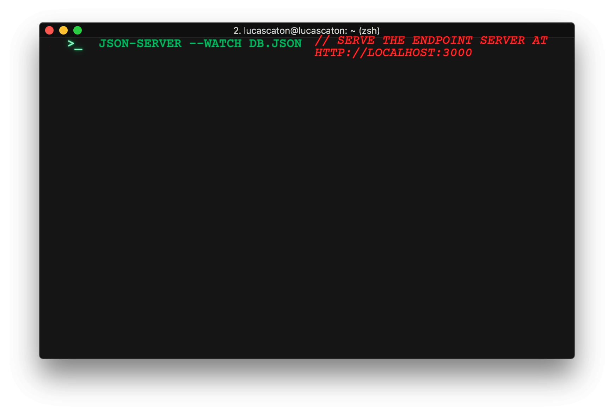

## Code scaffolding

To generate a new component
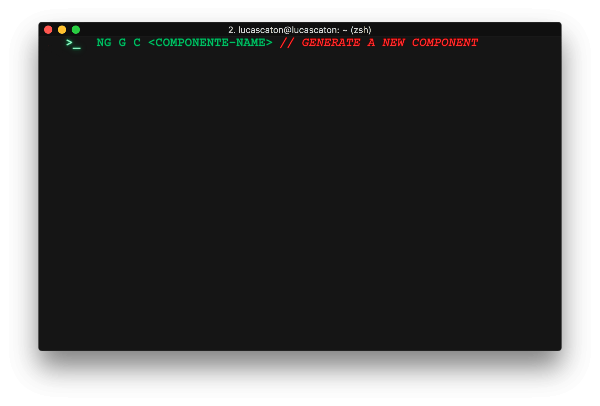

You can also use

To generate a new diretive
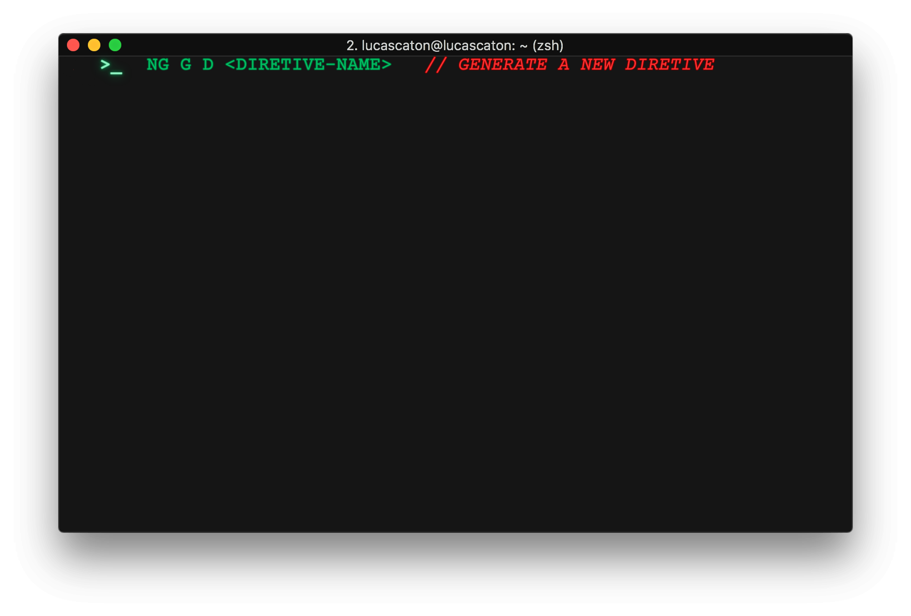

To generate a new pipe
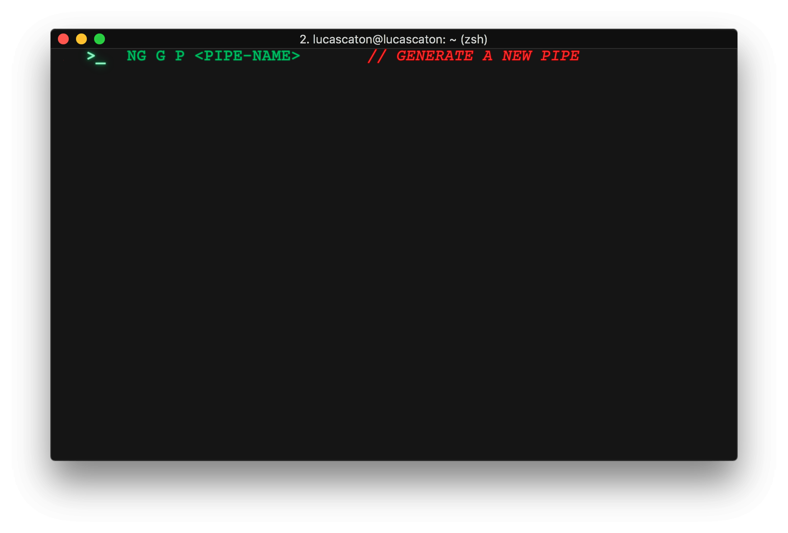

To generate a new service

To generate a new class
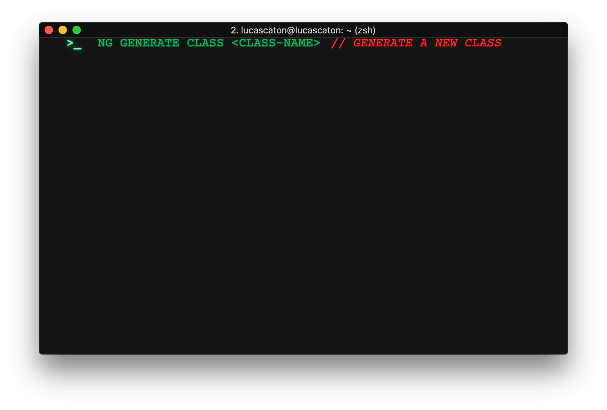

To generate a new guard
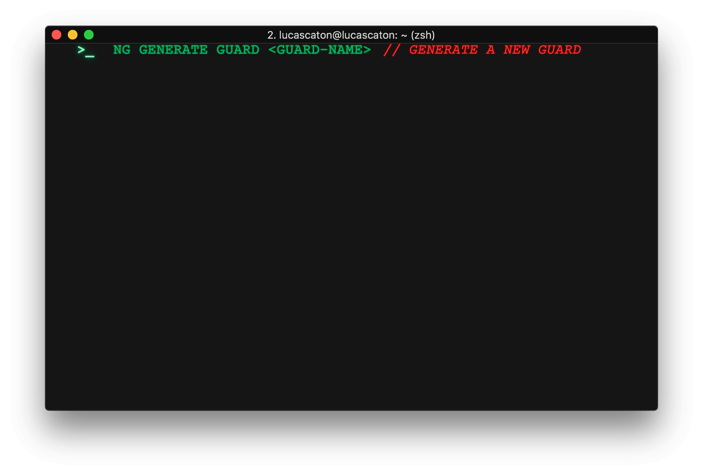

To generate a new interface
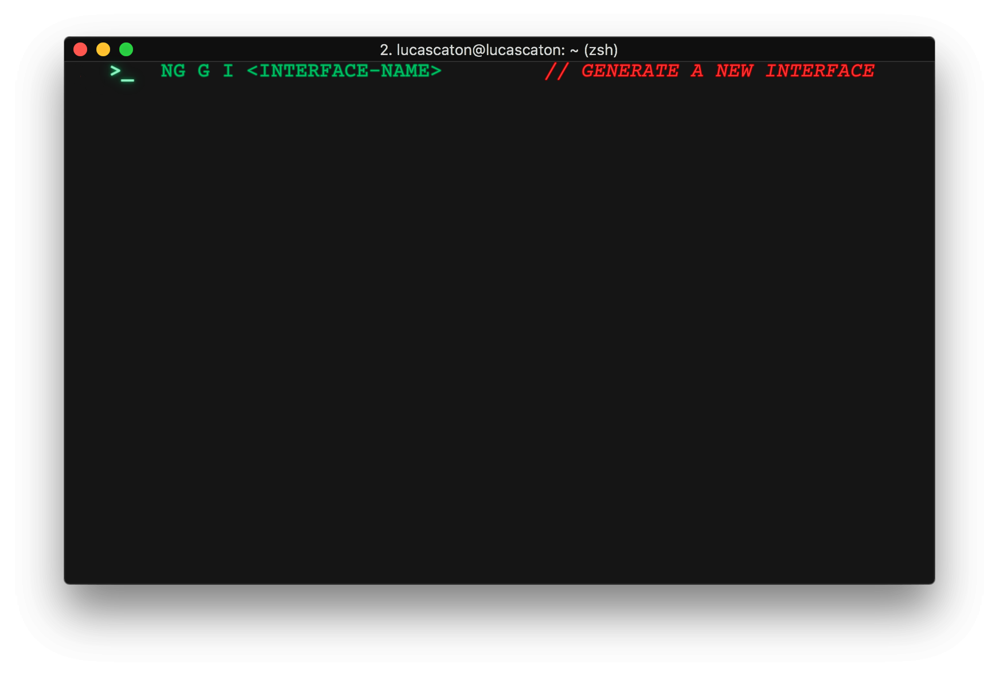

To generate a new enum
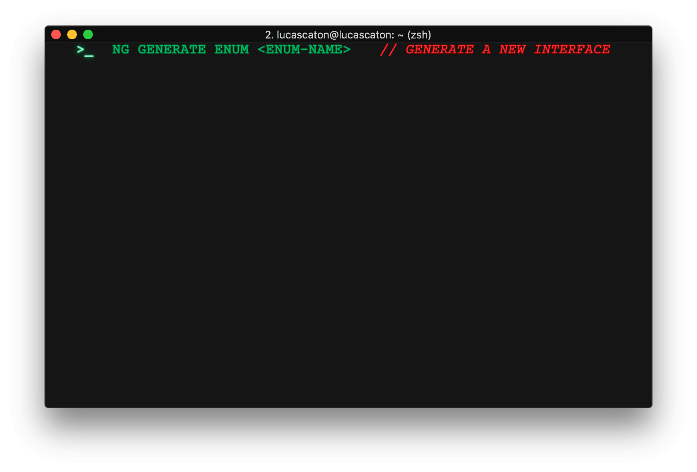

To generate a new module
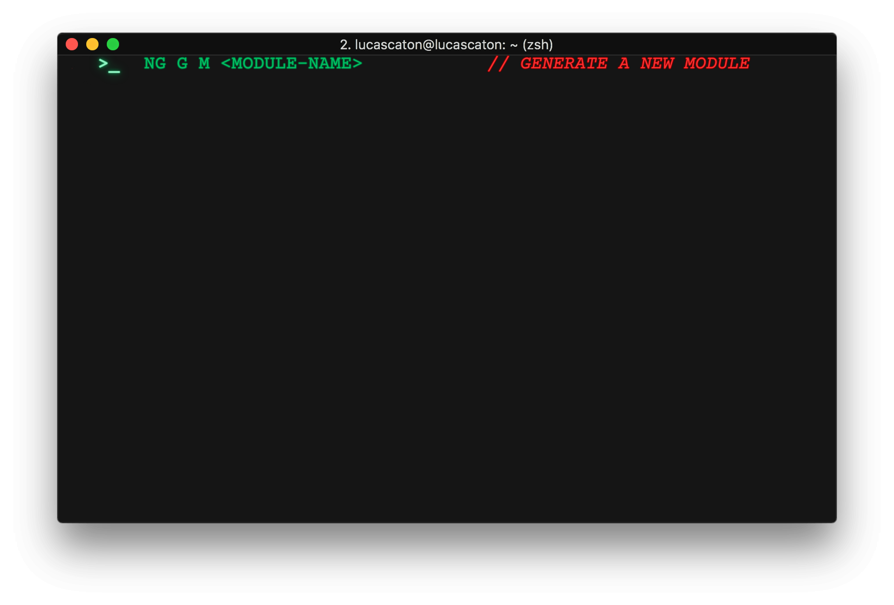

## Build

To build the project
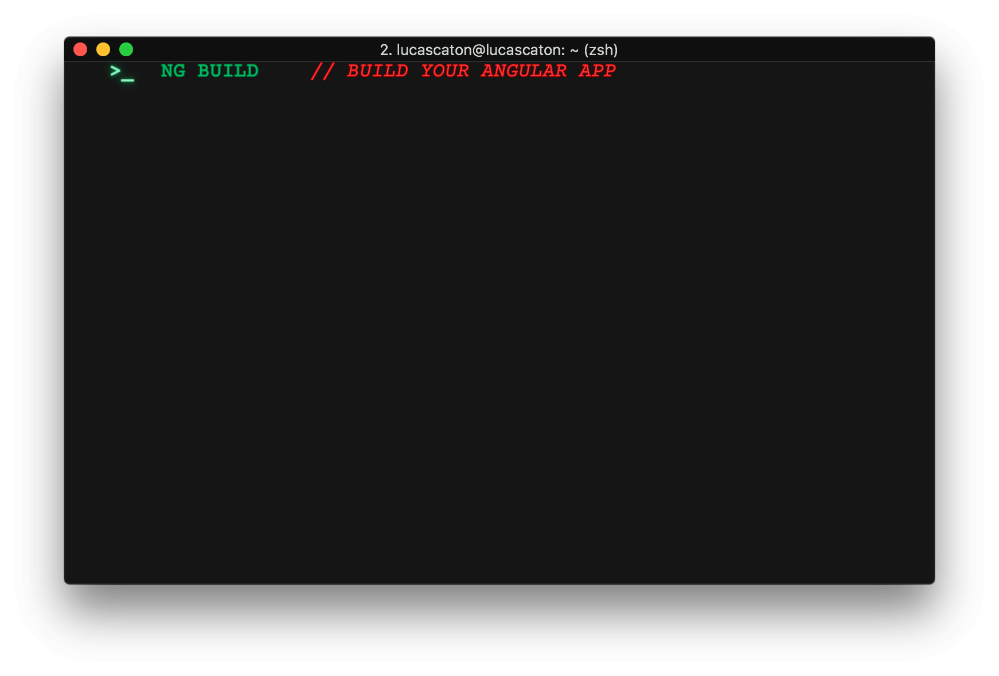

The build artifacts will be stored in the `dist/` directory.

## Running unit tests

To execute the unit tests via [Karma](https://karma-runner.github.io).
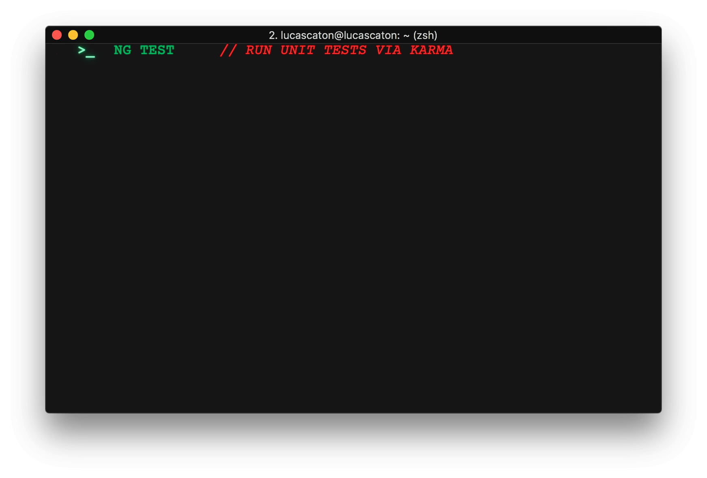

## Running end-to-end tests

To execute the end-to-end tests via a platform of your choice.
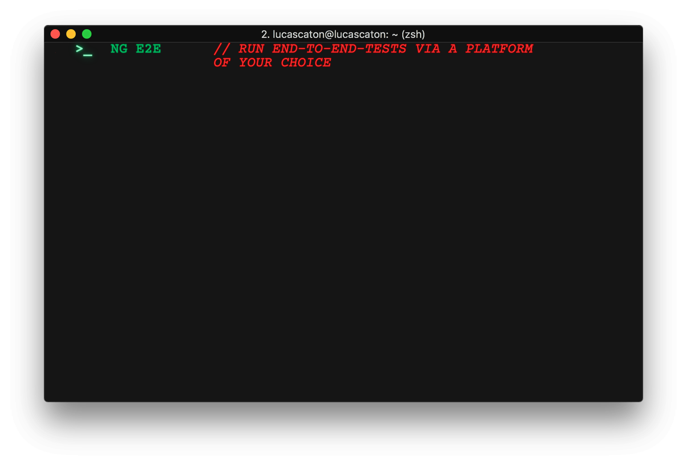

To use this command, you need to first add a package that implements end-to-end testing capabilities.

## Further help

To get more help on the Angular CLI use:
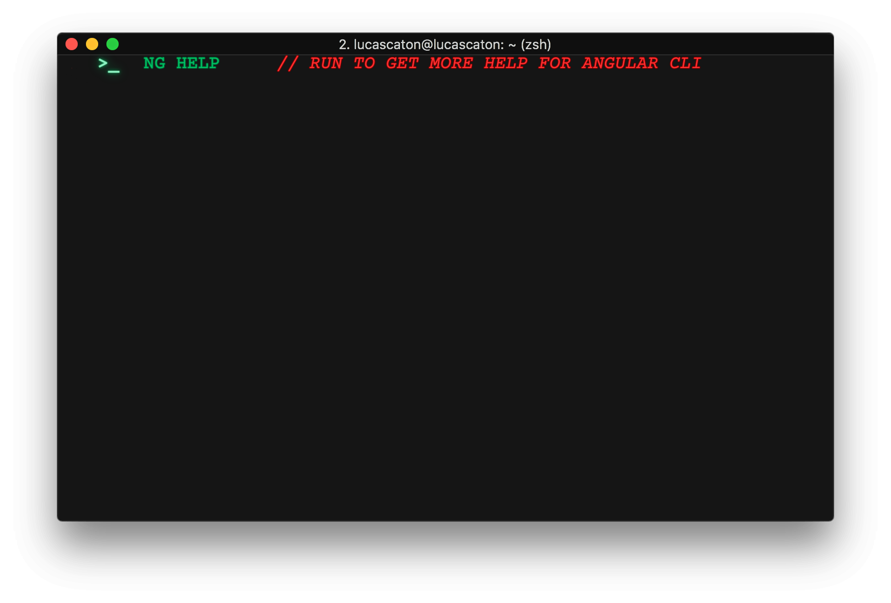

Or go check out the [Angular CLI Overview and Command Reference](https://angular.io/cli) page.

## Applied Technologies

&nbsp;
&nbsp;
&nbsp;
&nbsp;
